# 🏗️ System Architecture: The "Perfect" Deep Dive

> **C4 Model • Polyglot • Event-Driven**
>
> This document provides a level-4 technical breakdown of the Bookstack platform. It covers the **Context**, **Containers**, **Components**, and **Infrastructure** that make up our scalable library system.

---

## 1. 🌍 C4 System Context
**Who uses the system and how does it fit into the world?**

---

## 2. 📦 Container Diagram (The Microservices)
** What are the deployable units and how do they talk?**

Our system is a **Polyglot Cluster** orchestrated by Kubernetes. We pick the best language for the task:
- **Java**: Complex Business Logic & Security.
- **Node.js**: frequent I/O & Catalog Search.
- **.NET**: High-performance Logging.

```mermaid
graph TD
    Client[📱 React Client] -->|HTTP :80| Gateway[🚪 API Gateway :7070]
    
    subgraph "Internal Network (Docker/K8s)"
        Gateway -->|/auth| Auth[🔐 Auth Server :9090]
        Gateway -->|/member| Core[📚 Bookstack Core :8080]
        Gateway -->|/book| Catalog[📗 Book Service :4000]
        Gateway -->|/log| Logger[📝 Logger :5020]
        
        Core -.->|Feign/Sync| Catalog
        Core -.->|Feign/Sync| Auth
        
        Core -->|Produce :8080| Kafka{📨 Kafka Broker :9092}
        Kafka -->|Consume| Messaging[🔔 Messaging Service :5050]
    end
    
    Auth --> DB_Auth[(Auth DB)]
    Core --> DB_Core[(Core DB)]
    Catalog --> DB_Book[(Book DB)]
    Messaging --> SMTP[📧 SMTP Server]
```

### 🧩 Service Roles & Responsibilities

| Service | Technology | Port | Resp. | Why this Tech? |
| :--- | :--- | :--- | :--- | :--- |
| **Gateway** | Spring Cloud Gateway | `7070` | Routing, Rate Limiting. | Native integration with Spring logic. |
| **Auth** | Spring Security | `9090` | JWT Issuance, User DB. | Industry standard security features. |
| **Core** | Java 21 / Spring Boot | `8080` | Transactions, Rentals, Fines. | Robust for ACID transactions. |
| **Catalog** | Node.js / Express | `4000` | Search, Recommendations. | Non-blocking I/O for heavy read ops. |
| **Messaging**| Spring Boot | `5050` | Email broadcast. | Easy integration with Kafka/Spring. |
| **Logger** | .NET 8 | `5020` | Audit Logs. | High-throughput text processing. |

---

## 3. 🔄 Data Flow Analysis

We use a hybrid communication strategy: **Sync** for consistency, **Async** for performance.

### ⚡ Synchronous Flow (Strict Consistency)
*Example: Admin checks stock before approving a rental.*

1.  **Core** receives `POST /rent`.
2.  **Core** calls **Auth** (`GET /auth/users`) via `AuthorizationClient` to verify user status.
3.  **Core** calls **Catalog** (`GET /book/copy`) via `BookClient` to check physical availability.
4.  **Core** commits the transaction to `bookstack_db` only if both succeed.
5.  **Core** returns `200 OK` to user.

### 📨 Asynchronous Flow (High Performance)
*Example: Sending a generic newsletter to 10,000 members.*

1.  **Admin** POSTs newsletter to **Core**.
2.  **Core** validates input and immediately returns `200 OK` (User is not blocked).
3.  **Core** produces event to Kafka Topic `email-topic`.
4.  **Messaging Service** wakes up, consumes the event.
5.  **Messaging Service** calls **Auth** to get the email list.
6.  **Messaging Service** sends 10,000 emails via SMTP in the background.

---

## 4. 🗄️ Database Design (Database-per-Service)

To ensure loose coupling, services **do not govern** each other's databases.

### 🔐 Authorization DB (`authorization`)
*   **Tables**: `user_table`, `roles`.
*   **Owner**: Auth Server.
*   **Constraint**: Contains PII (Passwords, Phones). Only Auth Server can read this.

### 📚 Bookstack DB (`bookstack`)
*   **Tables**: `membership_data`, `rent_records`, `records`, `fines`.
*   **Owner**: Core Service.
*   **Constraint**: The "Truth" about who has what book.

### 📗 Catalog DB (`book_db`)
*   **Tables**: `book_table`, `images`.
*   **Owner**: Node.js Service.
*   **Constraint**: Optimized for `LIKE %query%` searches.

---

## 5. 🏗️ Infrastructure & Deployment

The entire stack is containerized.

### 🐳 Docker Networking
*   **Network Name**: `bookstack-net`
*   **Gateway**: Exposed to Host (`7070`).
*   **Services**: internal-only (not reachable from Host directly).

### ☸️ Kubernetes (K8s) Mapping
*   **Pods**: One per microservice (ReplicaSet).
*   **Services**: ClusterIP for internal, NodePort for Gateway.
*   **ConfigMaps**: `application.properties` injected at runtime.
