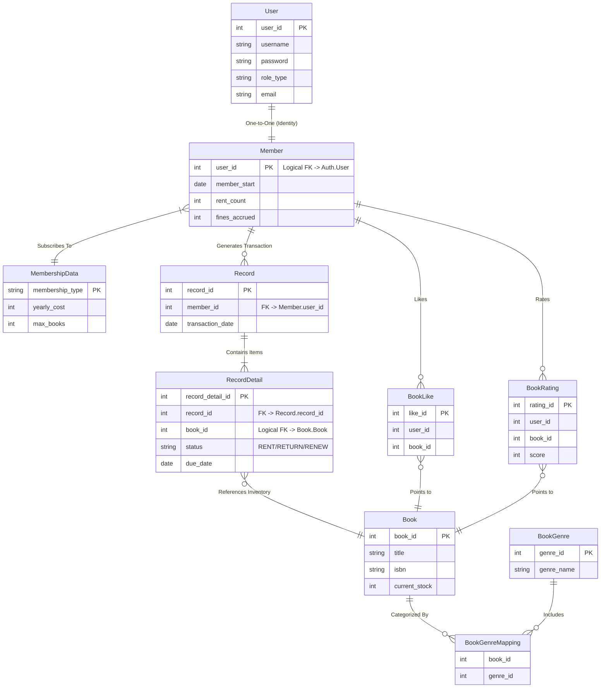

# �️ Database Architecture & Schema

> **Database-per-Service Pattern**
>
> The Bookstack platform uses a distributed data architecture. Each microservice governs its own database to ensure loose coupling and independent scalability.
> No service is allowed to strictly "JOIN" across these boundaries; instead, they communicate via APIs (Sync) or Kafka (Async).

---

## 🌍 Global ER Diagram (Conceptual)
This high-level view shows how the logical entities relate, even though they physically reside in different databases.

---

## 🌍 Global ER Diagram (Enhanced)

This diagram visualizes the **complete data model**.
It is segmented into three "Service Boundaries" to show which database owns which data.
**Logical Relationships** (dotted lines) indicate connections maintained by API logic, not SQL constraints.



---


---

## 1. 🔐 Authorization Database (`auth_db`)
**Service Owner**: Auth Server (Spring Boot)
**Role**: Identity Provider (IdP). Stores credentials and high-level user profiles.

### `user_table`
| Column | Type | Constraints | Description |
| :--- | :--- | :--- | :--- |
| `user_id` | INT | **PK**, Auto Inc | Unique identifier for every user/staff/admin. |
| `username` | VARCHAR(15) | Unique | Login ID. |
| `password` | VARCHAR(100) | | BCrypt encoded password. |
| `role_type` | VARCHAR(45) | | `MEMBER`, `LIBRARIAN`, `ADMIN`. |
| `name` | VARCHAR(30) | | Full display name. |
| `email` | VARCHAR(30) | | Contact email (used for Kafka notifications). |
| `phone` | VARCHAR(10) | | Contact number. |
| `dob` | DATE | | Date of Birth. |
| `address` | VARCHAR(45) | | Physical address. |

---

## 2. 📚 Bookstack Core Database (`bookstack_db`)
**Service Owner**: Bookstack Service (Java)
**Role**: Business Logic Store. Manages memberships, transaction history, and fines.

### `member_table`
*Represents the "Library Card" aspect of a user.*
| Column | Type | Constraints | Description |
| :--- | :--- | :--- | :--- |
| `user_id` | INT | **PK** | Logical FK to `auth_db.user_table.user_id`. |
| `membership_type` | VARCHAR | FK | Links to `membership_data` (e.g., "GOLD"). |
| `rent_count` | INT | | Current number of active rentals. |
| `renew_count` | INT | | Total renewals used this cycle. |
| `member_start` | DATE | | Membership valid from. |
| `member_end` | DATE | | Membership expires on. |

### `book_like`
*Tracks user engagement.*
| Column | Type | Constraints | Description |
| :--- | :--- | :--- | :--- |
| `like_id` | INT | **PK**, Auto Inc | |
| `user_id` | INT | | Logical FK to User. |
| `book_id` | INT | | Logical FK to `book_db.book_table`. |
*Constraint: Unique(`user_id`, `book_id`) - One like per book per user.*

### `membership_data`
*Configuration table for Plans.*
| Column | Type | Constraints | Description |
| :--- | :--- | :--- | :--- |
| `membership_type` | VARCHAR | **PK** | "GOLD", "SILVER", "PLATINUM". |
| `yearly_cost` | INT | | Price in INR. |
| `max_books` | INT | | Max rentals allowed at once (e.g., 5). |

### `record` & `record_detail`
*The Ledger. Stores every rent, return, and renew event.*

---

## 3. 📗 Catalog Database (`book_db`)
**Service Owner**: Book Service (Node.js)
**Role**: High-Performance Catalog. Optimized for search and browsing.

### `book_table`
| Column | Type | Constraints | Description |
| :--- | :--- | :--- | :--- |
| `book_id` | INT | **PK**, Auto Inc | Global ID for the book. |
| `isbn` | VARCHAR(13) | Not Null | International Standard Book Number. |
| `title` | VARCHAR(255) | Not Null | Book Title (Indexed for Search). |
| `author` | VARCHAR(255) | Not Null | Author Name. |
| `publisher` | VARCHAR(100) | | Publisher Name. |
| `number_of_copies` | INT | | Total physical inventory. |
| `number_of_copies_remaining` | INT | | **Critical**: available stock. |
| `book_image` | VARCHAR(255) | | Filename of the cover image. |

---

## 4. 🧩 Cross-Service Relationships

Since we cannot use SQL JOINS, we handle relationships via **API Composition**.

### Example: "Get My Profile"
1.  **Frontend** requests `GET /member/profile`.
2.  **Core** fetches `member_table` (rent counts).
3.  **Core** calls **Auth Service** (`GET /auth/user/{id}`) to get Name/Email.
4.  **Core** combines the data:
    ```json
    {
      "name": "John Doe",       // from Auth DB
      "rentCount": 2,           // from Core DB
      "membership": "GOLD"      // from Core DB
    }
    ```

### Example: "Browse Books"
1.  **Node.js Service** queries `book_db` for titles matching "Harry Potter".
2.  Returns list directly to Frontend.
3.  (Frontend may fetch "Likes" separately from Core to overlay on the UI).
