# 📨 Messaging & Notifications System

> **At a Glance**
>
> **Goal**: Send emails (newsletters, fines, reminders) without slowing down the app.
> **Solution**: We use **Apache Kafka** to create a "Fire and Forget" system. The main app drops a message in a box (topic) and immediately goes back to work. A separate worker picks it up later to send the emails.

---

## 🌊 1. High-Level Overview (The "Why")

Imagine a library with 10,000 members. If the Admin clicks "Send Newsletter" and the system tries to email all 10,000 people one by one, the screen would freeze for 30 minutes!

**Our Solution**:
1.  Admin clicks "Send".
2.  System says "Got it!" instantly (0.1 seconds).
3.  Behind the scenes, a background worker quietly sends the emails one by one.

### 🎨 Visual Flow

```mermaid
sequenceDiagram
    participant Admin
    participant Core as 📚 Core App
    participant Kafka as 📨 Kafka Queue
    participant Worker as 🔔 Msg Service
    participant User as 📧 User Inbox

    Admin->>Core: Click "Send Newsletter"
    Core->>Kafka: Drop Message ("Send to All")
    Kafka-->>Core: Acknowledge (Instant)
    Core-->>Admin: "Success! Emails are sending..."
    
    Note right of Kafka: ...Time Passes...
    
    Kafka->>Worker: "New Job: Send to All"
    Worker->>Worker: Fetch Email List
    
    loop For Each Member
        Worker->>User: SMTP Email
    end
```


---

## 🏗️ 2. Developer Deep Dive (The "How")

This section explains exactly what happens in the code.

### Phase 1: The Producer (`Bookstack Service`)
*   **Role**: Drops the message.
*   **File**: `StaffService.java`
*   **Logic**: It constructs a lightweight **DTO** containing just the HTML content, not the recipient list.

```java
// 1. Create the payload
String htmlContent = "<h1>New Books Arrived!</h1>...";
EmailDTO event = new EmailDTO(htmlContent, null);

// 2. Push to Kafka (Non-blocking)
kafkaTemplate.send("email-topic", event);
```

### Phase 2: The Broker (`Apache Kafka`)
*   **Role**: The post office.
*   **Topic**: `email-topic`
*   **Guarantee**: It ensures the message is never lost, even if the Email Service is temporarily crashed.

### Phase 3: The Consumer (`Messaging Service`)
*   **Role**: The worker.
*   **File**: `MessageService.java`
*   **Logic**:
    1.  Wakes up when `email-topic` has data.
    2.  Calls **Auth Service** to get the latest list of 10,000 active emails.
    3.  Iterates and sends via SMTP.

```java
@KafkaListener(topics = "email-topic")
public void handleEvent(EmailDTO event) {
    // A. Fetches standard email list
    List<String> recipients = authClient.getEmails();

    // B. Sends emails (This takes time, but no one is waiting!)
    for(String email : recipients) {
        mailSender.send(email, event.getContent());
    }
}
```

---

## ⚙️ Configuration Reference

### Kafka Setup (Producer)
In `server/bookstack/src/main/resources/application.properties`:
```properties
spring.kafka.producer.bootstrap-servers=localhost:9092
spring.kafka.template.default-topic=email-topic
```

### SMTP Setup (Consumer)
In `server/messaging/src/main/resources/application.properties`:
```properties
# Google SMTP
spring.mail.host=smtp.gmail.com
spring.mail.port=587
spring.mail.username=library-notifications@gmail.com
spring.mail.password=${SMTP_PASSWORD}
```

---

## 🏆 Key Benefits
1.  **Zero UI Lag**: Users never wait for emails to send.
2.  **Fault Tolerance**: If Google SMTP is down, Kafka holds the message. We can retry later without losing data.
3.  **Scalability**: Need to send 1 million emails? Just spin up 5 more instances of `Messaging Service`.
