# 💳 Feature Deep Dive: Payments (Razorpay)

> **Secure, Server-Side Verified Transactions**
>
> **Goal**: Accept payments for Memberships (Gold, Platinum) securely.
> **Solution**: We use **Razorpay** with a strict "Server-Side Verification" pattern to prevent frontend tampering.

---

## 🌊 1. High-Level Overview (The "Why")

In many simple apps, the frontend says "I paid 500 rupees!" and the backend believes it. This is dangerous because a hacker can fake that message.

**Our Solution**:
1.  **Backend** creates the Order (Frontend cannot choose the price).
2.  **User** pays Razorpay directly.
3.  **Backend** cryptographically verifies the receipt using a Secret Key.

### 🎨 Visual Flow

```mermaid
sequenceDiagram
    participant User
    participant React as 📱 Frontend
    participant Core as 📚 Core Backend
    participant RZP as 🏦 Razorpay API

    Note over User: Clicks "Buy Gold Membership"

    React->>Core: 1. Start Payment (Plan=GOLD)
    Core->>Core: Calculate Price (500 INR)
    Core->>RZP: Create Order
    RZP-->>Core: Order ID: order_Kz2s...
    Core-->>React: Return Order ID

    React->>RZP: 2. Checkout Popup (User Pays)
    RZP-->>React: Payment Success (Signature)

    React->>Core: 3. Verify Payment + Activate
    Core->>Core: Hash(Order + Payment) == Signature?
    
    alt Signature Matches
        Core->>Core: Update DB (Membership = GOLD)
        Core-->>React: Success!
    else Signature Fails
        Core-->>React: Fraud Detected!
    end
```


---

## 🏗️ 2. Developer Deep Dive (The "How")

### Phase 1: Creating the Order
**Endpoint**: `POST /membership/start-payment`

We never trust the client to send the amount. We look up the price in our database.

```java
// MembershipController.java
public Map<String, Object> startPayment(String type) {
    // 1. Fetch official price from DB
    int amount = repository.findPriceByType(type); // e.g., 50000 paise (500 INR)

    // 2. Ask Razorpay to open an order
    JSONObject options = new JSONObject();
    options.put("amount", amount);
    options.put("currency", "INR");
    
    Order order = razorpayClient.orders.create(options);
    
    // 3. Return ID to frontend
    return Map.of("orderId", order.get("id"));
}
```

### Phase 2: Verifying the Signature
**Endpoint**: `POST /membership/payment-success`

This is the most critical step. We use the **HMAC-SHA256** algorithm to ensure the payment receipt is authentic.

```java
// RazorpayService.java
public void verifySignature(String orderId, String paymentId, String signature) {
    String payload = orderId + "|" + paymentId;
    String secret = "${RAZORPAY_SECRET}"; // Loaded from env

    // 1. Generate local hash
    String generatedSignature = HmacSha256(payload, secret);

    // 2. Compare 
    if (!generatedSignature.equals(signature)) {
         throw new SecurityException("Tampered Payment Detected!");
    }
    
    // 3. Activate Membership
    activateMembership(user);
}
```

---

## ⚙️ Configuration Reference

**Security Note**: Never commit real keys to GitHub. Use Environment Variables.

### `application.properties`
```properties
# Razorpay Credentials (Use Test Keys for Dev)
razorpay.key.id=rzp_test_xxxxxxxxxxxxxx
razorpay.key.secret=${RAZORPAY_KEY_SECRET}

```

---

## 🏆 Key Benefits
1.  **Tamper Proof**: Users cannot change the price to 1 Rupee in the browser console.
2.  **Compliance**: We rely on Razorpay's PCI-DSS compliant checkout; we never touch raw card numbers.
3.  **Audit Trail**: Every transaction is linked to a specific Order ID in both our DB and Razorpay's dashboard.
