# 🔍 Feature Deep Dive: Search System

> **High-Performance Catalog Search**
>
> **Goal**: Users want to find books instantly by Title, Author, or ISBN.
> **Solution**: We use a dedicated **Node.js Microservice** optimized for read-heavy operations, bypassing the heavier Java business layer.

---

## ⚡ 1. High-Level Overview (The "Why")

Why do we have a separate "Book Service" in Node.js when the main app is in Java?

**The Speed Problem**: Java Spring Boot is robust but heavy (great for transactions). Search needs to be lightweight and fast.
**The Solution**: Node.js is non-blocking and perfect for I/O operations like querying a database 100 times a second.

### 🎨 Visual Flow

```mermaid
sequenceDiagram
    participant User
    participant React as 📱 Frontend
    participant Gateway as 🚪 API Gateway
    participant Node as ⚡ Node.js Service
    participant DB as 📗 Book DB

    User->>React: Types "Harry"
    React->>Gateway: POST /book/search
    Gateway->>Node: Route to Port 4000
    
    Node->>DB: SELECT ... LIKE %Harry%
    DB-->>Node: Returns 5 Matches
    
    Node->>Node: Map to CamelCase
    Node-->>React: JSON Response array
    React-->>User: Dropdown appears instantly
```


---

## 🏗️ 2. Developer Deep Dive (The "How")

### The "Smart" SQL Query
**File**: `server/book-service/routes/book.routes.js`

We don't just search one field. We check **four** columns at once.

```javascript
/* 
   Query Strategy:
   1. Title matches? (e.g., "Harry")
   2. OR ISBN matches? (e.g., "978...")
   3. OR Author matches? (e.g., "Rowling")
   4. OR Publisher matches?
*/
const sql = `
  SELECT * FROM book_table
  WHERE
    title LIKE ?
    OR isbn LIKE ?
    OR author LIKE ?
    OR publisher LIKE ?
  LIMIT 5
`;
```

### Why Logic in SQL?
By using `LIKE %value%` with `OR`, we push the heavy lifting to the MySQL engine, which is optimized for text scanning. We limit results to `5` to prevent over-fetching data for the autocomplete dropdown.

### Data Transformation (Snake -> Camel)
Databases use `snake_case` (e.g., `book_image`), but React prefers `camelCase`. The Node.js service acts as a translator.

```javascript
// Raw DB Row -> API Response
const mapped = results.map(row => ({
    bookId: row.book_id,          // Transformed
    title: row.title,
    bookImage: row.book_image,    // Transformed
    // ...
}));
```

---

## 📡 API Specification

### Search Books
*URL*: `http://localhost:7070/book/search`

| Field | Type | Description |
| :--- | :--- | :--- |
| `search` | `string` | The query (e.g., "Rowling"). |

**Response Example**:
```json
[
  {
    "bookId": 12,
    "title": "Harry Potter and the Sorcerer's Stone",
    "author": "J.K. Rowling",
    "isbn": "9780590353427",
    "bookImage": "hp1.jpg",
    "numberOfCopiesRemaining": 5
  }
]
```

---

## 🏆 Key Benefits
1.  **Latency**: Node.js handles concurrent searches much faster than a threaded blocking server.
2.  **Decoupling**: If the Search service crashes, the main Admin/Rental system (Java) keeps working.
3.  **Efficiency**: By returning only 5 results, we minimize network bandwidth on mobile devices.
