# ⚛️ Redux State Rehydration on Page Refresh (BookStack)

> **A backend‑authoritative, production‑grade strategy for restoring Redux state after a browser refresh**

Redux state lives only in memory (RAM). A browser refresh restarts the JavaScript runtime, which **always resets Redux**. This document defines the **intentional rehydration architecture** used in BookStack to rebuild Redux state immediately after app load—without using `localStorage`, `redux-persist`, or frontend auth logic.

---

## 🎯 Design Goals

* **Correctness over convenience** – backend is the single source of truth
* **No stale state** – every refresh reflects current server data
* **No frontend auth coupling** – JWT/session handled by backend
* **Predictable Redux lifecycle** – reset → rehydrate → render
* **Zero flicker UX** – controlled loading gates

---

## ❌ The Problem (By Design)

* Redux is wiped on refresh (expected)
* Member‑specific UI (likes, flags) temporarily disappears
* UI may render in an incorrect or incomplete state

> This is not a Redux bug. It is a lifecycle mismatch.

---

## ✅ The Solution: Backend‑Driven Rehydration

Instead of persisting Redux state locally, BookStack **rebuilds Redux from the backend** on every application load.

### Why this is the correct choice

* Backend already validates identity via JWT/cookie
* Backend has the freshest member state
* No client‑side cache invalidation logic required

> **Redux is treated as a short‑lived cache, not durable storage.**

---

## 🔁 Application Lifecycle

1. Browser refresh → Redux resets
2. React app mounts
3. Hydration thunks are dispatched
4. Backend returns authoritative member data
5. Redux state is reconstructed
6. UI renders with correct state

---

## 🎨 Visual Lifecycle

```mermaid
sequenceDiagram
    participant Browser
    participant App as ⚛️ App.jsx
    participant Redux as 🧠 Redux Store
    participant API as ☁️ Backend

    Browser->>App: Page Refresh (F5)
    Note right of Redux: In‑memory state cleared

    App->>Redux: App mounts
    App->>API: loadLikesFromBackend()

    API-->>App: 200 OK [bookId...]
    App->>Redux: Normalize & restore state

    Redux->>Browser: Render member UI
```



---

## 🧠 What Is Rehydrated

| Data           | Source     | Reason                          |
| -------------- | ---------- | ------------------------------- |
| Liked book IDs | Backend    | Must be accurate across devices |
| Member context | Backend    | Authoritative                   |
| UI flags       | Redux only | Ephemeral                       |

**Not rehydrated:**

* JWT contents
* Auth state
* Tokens

---

## 🏗️ Redux Store Configuration

**File:** `redux/store.js`

```js
import { configureStore } from "@reduxjs/toolkit";
import likeReducer from "./slices/likeSlice";

/**
 * Redux Store
 * =========================================================================
 * Redux is ephemeral by design. All durable state is rebuilt from the backend
 * via hydration thunks on application startup.
 */
export const store = configureStore({
  reducer: {
    likes: likeReducer
  }
});

export default store;
```

---

## 🔄 Hydration Thunk

**File:** `redux/slices/likeSlice.js`

```js
import { createSlice, createAsyncThunk } from "@reduxjs/toolkit";
import api from "../../api/api";

/**
 * Rehydrates liked books from the backend.
 * Executed once on application mount.
 */
export const loadLikesFromBackend = createAsyncThunk(
  "likes/load",
  async () => {
    const res = await api.get("/member/likes");
    return res.data;
  }
);
```

---

## 🧩 Slice Design (Normalized, Predictable)

```js
const likeSlice = createSlice({
  name: "likes",
  initialState: {
    byBookId: {},
    loading: false
  },
  reducers: {
    /**
     * Optimistic UI update.
     * Backend sync is handled separately.
     */
    toggleLike: (state, action) => {
      const bookId = action.payload;
      state.byBookId[bookId] = !state.byBookId[bookId];
    }
  },
  extraReducers: (builder) => {
    builder
      .addCase(loadLikesFromBackend.pending, (state) => {
        state.loading = true;
      })
      .addCase(loadLikesFromBackend.fulfilled, (state, action) => {
        const normalized = {};

        if (Array.isArray(action.payload)) {
          action.payload.forEach((id) => {
            normalized[id] = true;
          });
        } else if (action.payload && typeof action.payload === "object") {
          Object.assign(normalized, action.payload);
        }

        state.byBookId = normalized;
        state.loading = false;
      })
      .addCase(loadLikesFromBackend.rejected, (state) => {
        state.loading = false;
      });
  }
});

export const { toggleLike } = likeSlice.actions;
export default likeSlice.reducer;
```

---

## ⚛️ App Mount Hydration Gate

**File:** `App.jsx`

```js
import { useEffect } from "react";
import { useDispatch } from "react-redux";
import { loadLikesFromBackend } from "./redux/slices/likeSlice";

function App() {
  const dispatch = useDispatch();

  useEffect(() => {
    // Rebuild Redux state immediately on load
    dispatch(loadLikesFromBackend());
  }, [dispatch]);

  return (
    // Routes render with hydration in progress
  );
}
```

---

## 🏆 Architectural Benefits

* **Fresh by default** – no stale cache
* **Backend‑owned security** – frontend does not guess state
* **Predictable lifecycle** – reset → hydrate → render
* **Easy to extend** – add more hydration thunks

---

## 🚫 Explicitly Avoided Anti‑Patterns

* ❌ `localStorage` persistence
* ❌ redux‑persist
* ❌ JWT decoding on frontend
* ❌ Redux‑based authentication
* ❌ UI rendering before state hydration

---

## 📌 Final Principle

> **Redux should be rebuilt, not preserved.**

BookStack treats Redux as a volatile cache that is safely and deterministically reconstructed from the backend on every load.

This is a **production‑grade, scalable, and security‑correct architecture**.
