# ⚛️ Redux State: Handling Refresh & Rehydration

> **Solving the "Blank Screen" Problem**
>
> **The Problem**: Redux state lives in RAM. When a user hits "Refresh", the RAM is cleared, and the user appears "logged out".
> **The Solution**: We implementation a robust **Rehydration Strategy** that restores the state from the backend immediately upon app load.

---

## � 1. High-Level Overview (The "Why")

In a traditional app, you might use `localStorage` to save the user's name. But what if they changed their name on another device? `localStorage` is stale.

**Our Approach**:
1.  **Browser Load**: App starts with empty state (`user: null`).
2.  **App Mount**: We check for a valid JWT in cookies.
3.  **Hydration**: We immediately fire an API call (`/auth/me`) to get the *freshest* data from the database.
4.  **Ready**: Only after this finishes do we show the private routes.

### 🎨 Visual Lifecycle

```mermaid
sequenceDiagram
    participant Browser
    participant App as ⚛️ App.jsx
    participant Redux as 🧠 Redux Store
    participant API as ☁️ Backend

    Browser->>App: User hits F5 (Refresh)
    Note right of Redux: State is WIPED (Reset to Initial)
    
    App->>API: 1. checkAuth() (AsyncThunk)
    API-->>App: 200 OK { user: "John", role: "ADMIN" }
    
    App->>Redux: 2. Update Role = ADMIN
    Redux->>Browser: 3. Render Admin Dashboard
```


---

## 🏗️ 2. Developer Deep Dive (The "How")

### The Hydration Thunk
**File**: `client/src/redux/slices/authSlice.js`

We create a special thunk called `checkAuth` that runs *once* when the application mounts.

```javascript
/* 
   The Rehydrator 
   - Runs on App Mount
   - Restores User Session
*/
export const checkAuth = createAsyncThunk(
  "auth/checkAuth",
  async (_, { rejectWithValue }) => {
    try {
      // 1. Call Backend to verify Cookie/Token
      const response = await api.get("/auth/user/me");
      
      // 2. Return fresh User Data
      return response.data; 
    } catch (error) {
      // 3. If failed, we are truly logged out
      return rejectWithValue(error.response.data);
    }
  }
);
```

### The Initial Mount Logic
**File**: `App.jsx`

This is where the magic happens. We dispatch the action before rendering routes.

```javascript
function App() {
  const dispatch = useDispatch();
  
  useEffect(() => {
    // 🔥 THE FIX: Immediately restore state on load
    dispatch(checkAuth());
    dispatch(loadLikesFromBackend()); 
  }, [dispatch]);

  return (
    <Routes>
       {/* Routes are protected until checkAuth finishes */}
       <Route path="/member" element={<ProtectedRoute><MemberHome /></ProtectedRoute>} />
    </Routes>
  );
}
```

---

## 🍕 Slice Configuration

We handle the `fulfilled` state to update the store with the data we just got back.

```javascript
const authSlice = createSlice({
  name: "auth",
  initialState: {
    user: null,    // Starts Empty
    isLoading: true // Starts Loading
  },
  extraReducers: (builder) => {
    builder
        // When Rehydration Succeeds
        .addCase(checkAuth.fulfilled, (state, action) => {
            state.user = action.payload; // Restore User
            state.isLoading = false;     // App is Ready
        })
        // When Rehydration Fails (Token Expired)
        .addCase(checkAuth.rejected, (state) => {
            state.user = null;           // Confirm Logout
            state.isLoading = false;     // App is Ready (to show Login page)
        });
  }
});
```

---

## 🏆 Key Benefits
1.  **Always Fresh**: We never show stale data from `localStorage`. If an admin banned the user 1 second ago, the refresh will catch it immediately.
2.  **Secure**: Sensitivity data (Roles, ID) is re-verified by the backend every time.
3.  **Seamless**: The `isLoading` flag allows us to show a "Loading Bookstack..." spinner instead of a glitchy login screen while we check.
