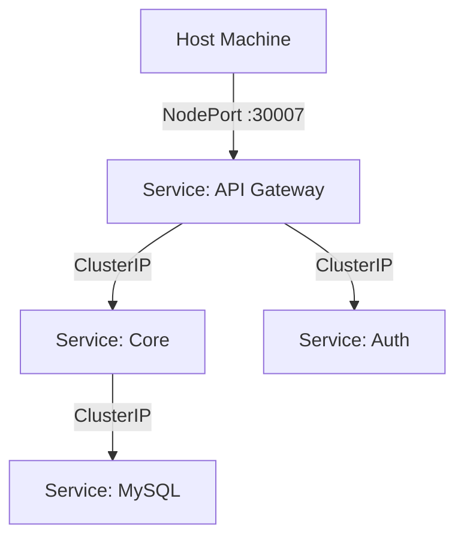

# 🐳 Technical Deep Dive: DevOps & Deployment

> **Containerization & Orchestration**
>
> **Strategy**: "Build Once, Deploy Anywhere".
> **Tools**: Docker (Packaging), Kubernetes (Runtime), Jenkins (Automation).

---

## 📦 1. Docker Strategy (Containerization)

Every microservice has a `Dockerfile`. We use **Multi-Stage Builds** to keep images small (especially for Java).

### ☕ Java Dockerfile (Standard Pattern)
*Used for: Auth, Core, Gateway, Messaging*

```dockerfile
# Stage 1: Build
FROM maven:3.9-eclipse-temurin-21 AS build
WORKDIR /app
COPY pom.xml .
COPY src ./src
RUN mvn clean package -DskipTests

# Stage 2: Run (Slim Image)
FROM eclipse-temurin:21-jre-alpine
WORKDIR /app
COPY --from=build /app/target/*.jar app.jar
ENTRYPOINT ["java", "-jar", "app.jar"]
```

### ⚡ Node.js Dockerfile
*Used for: Book Catalog*

```dockerfile
FROM node:18-alpine
WORKDIR /app
COPY package*.json ./
RUN npm install --production
COPY . .
CMD ["node", "app.js"]
```

---

## ☸️ 2. Kubernetes Architecture (K8s)

We do not use messy `docker run` commands. We use K8s **Manifests** for self-healing deployments.

### 📂 Manifest Structure (`/k8s`)
For every service (e.g., `auth-server`), we have two files:

1.  **ReplicaSet / Deployment (`*-rs.yaml`)**:
    *   Defines the Pod spec (Image, Env Vars, CPU Limits).
    *   Ensures `n` replicas are always running.
2.  **Service (`*-sc.yaml`)**:
    *   Defines the stable Network IP.
    *   Allows other pods to call it via DNS (e.g., `http://auth-server:9090`).

### 📝 Example: Auth Server Deployment

```yaml
# auth-server-rs.yaml
apiVersion: apps/v1
kind: Deployment
metadata:
  name: auth-server
spec:
  replicas: 1
  selector:
    matchLabels:
      app: auth-server
  template:
    metadata:
      labels:
        app: auth-server
    spec:
      containers:
      - name: auth-server
        image: bookstack/auth-server:latest
        imagePullPolicy: IfNotPresent
        ports:
        - containerPort: 9090
        env:
        - name: MYSQL_HOST
          value: "authorization-mysql"
```

---

## 🤖 3. Jenkins CI/CD Pipeline

We use Jenkins to automate the `deploy.sh` script logic.

### 🔄 The Pipeline Flow
1.  **Checkout**: Git pull latest code.
2.  **Build**: Run `mvn clean package` and `npm run build`.
3.  **Test**: Run Unit Tests (`mvn test`).
4.  **Dockerize**: Build `docker build -t ...`.
5.  **Deploy**: Run `kubectl apply -f k8s/`.

### 📄 Jenkinsfile (Declarative)

```groovy
pipeline {
    agent any
    stages {
        stage('Build Java') {
            steps {
                sh 'mvn clean package -DskipTests'
            }
        }
        stage('Build Docker') {
            steps {
                sh 'docker build -t my-repo/core:latest ./server/bookstack'
            }
        }
        stage('Deploy to K8s') {
            steps {
                sh 'kubectl apply -f k8s/auth-server-rs.yaml'
                sh 'kubectl apply -f k8s/auth-server-sc.yaml'
                // ... apply all others
            }
        }
    }
}
```

---

## 🌐 4. Network Topology

*   **ClusterIP**: Used for internal talk (Auth <-> Core). Not accessible from outside.
*   **NodePort**: Used for the **API Gateway** (`7070`) to expose the app to the host machine.


